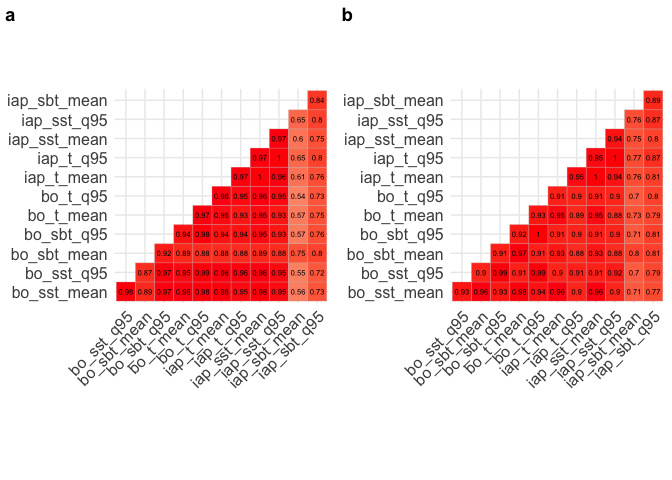

<!-- README.md is generated from README.Rmd. Please edit that file -->

Data and Code to support Webb et al., *Occupancy-derived thermal
affinities reflect known physiological thermal limits of marine
species*, accepted for publication in Ecology and Evolution.

The code below was developed using R version 3.5.2 (2018-12-20),
Platform: x86\_64-apple-darwin15.6.0 (64-bit), Running under: macOS
Mojave 10.14.4. In addition, the following packages need to be loaded:

``` r
library(tidyverse) #v1.2.1
library(worrms) #v0.3.2 
library(rfishbase) #v3.0.4
library(robis) #v2.1.10
library(lubridate) #v1.7.4
library(raster) #v2.9-5
library(sdmpredictors) #v0.2.8
library(naniar) #v0.4.2
library(ncdf4) #v1.16
library(ggcorrplot) #v0.1.1
library(cowplot) #v0.9.4
library(viridis) #v0.5.1
library(maps) #v3.3.0
```

# Shortcuts: Direct loading of temperature-matched data

The following few hundred lines document how we processed the thermal
limits datasets that we obtained for fish from Comte & Olden 2017,
<https://doi.org/10.1038/nclimate3382>, and for a wide range of species
from the GlobTherm Database, described in Bennett et al. (2018a,
<https://doi.org/10.1038/sdata.2018.22>) with the data itself published
in Dryad (Bennett et al. 2018b, <https://doi.org/10.5061/dryad.1cv08>) -
inlcuding taxonomy checking, adding habitat affinities or broad
functional groups, obtaining global occurrence records from OBIS and
matching these to global sea temperature datasets prior to summarising
the thermal affinities of each species. To circumvent this lengthy
process, we provide the following fully-processed datasets that can be
loaded directly and used to reproduce our results and figures:
`t_matched_co_exp_dat_full.csv` is the Comte-Olden data with temperature
affinities added for each species, and
`t_matched_globtherm_dat_full.csv` is the Globtherm data with added
temperature affinities. To read these in directly so that you can
proceed straight to the [Analysis and
Visualisation](#analysis-and-visualisation) section:

``` r
co_exp_dat <- read_csv("data/t_matched_co_exp_dat_full.csv")
globtherm_dat <- read_csv("data/t_matched_globtherm_dat_full.csv")
```

# Temperature Matching Functions

This set of 6 core functions performs the temperature-matching of
occurrence records. The input is the Aphia ID (standard valid taxonomic
ID from WoRMS, the World Register of Marine Species,
<http://www.marinespecies.org>) for a species of interest (see
documentation for `worrms::wm_name2id` for a way to get the Aphia ID of
a species from its scientific name). Given only the species ID, these
functions get all of its global occurrence records from OBIS, the Ocean
Biogeographic Information System <https://obis.org>, download relevant
global gridded sea temperature measures, and summarise the temperature
across the species’ occurrence records using a range of summary
statistics. The code has sensible defaults for organising and looking
for files, which you can use by setting:

``` r
use_defaults <- TRUE
```

This is recommended. The alternative is to set a bespoke filepath to
used for saving datafiles obtained and generated in the code to disk as
well as for checking for pre-existing files (i.e. if you have previously
run the code). Set is by adding your preferred path using something like
`bespoke_path <- "/Volumes/Shared/shefmeme2/Shared"` - NB - this may not
be entirely consistently implemented in the code below - I recommend
leaving `use_defaults` as `TRUE`.

## Functions to match marine species occurrence records to temperature

The following sections describe a series of functions that are provided
in the `occurrences temperature matching functions.R` R script.

## Overall temperature-matching function

The first function, `get_temp_summ_by_sp`, is a wrapper function for
getting global OBIS records for a single species, matching these to the
temperature datasets, and summarising the results. The arguments are
`sp_id`, which should be a valid WoRMS Aphia ID for a species known to
occur in OBIS (examples of how to obtain and check this are given
below). The default `save_all_recs` means that the full set of
occurrence records, matched to the various temperature datasets, for
this species will be saved to a CSV file. This is useful if you think
you may want to use the data for another purpose, or summarise in a
different way. It is also useful if you think you might be running this
code multiple times - setting `check_match` to `TRUE` means that the
function will check for the existence of a temperature-matched CSV file
before proceeding; this can save a lot of time. `use_defaults` is as
described above, and I recommend leaving this as `TRUE`. The function
returns a summary of temperature affinity of the species as a `tibble`.

## Getting OBIS records

The `get_obis_recs` function gets OBIS records for a given valid WoRMS
Aphia ID (argument `species_id`). You can also ask this function to
check that the Aphia ID actually occurs in OBIS using `missing_check`,
but it is recommended to do this prior to calling these functions (see
examples below). It returns a tibble of all OBIS records for the
species.

## Matching OBIS Records to Bio-ORACLE Temperatures

The `get_bio_oracle_t` function takes the OBIS records returned above
and matches them to Bio-ORACLE SST and SBT. The input is the OBIS
records returned above, the other arguments specify the Bio-ORACLE
layers to interrogate (`layercodes`) and specify where to save the
Bio-ORACLE data (here the assumption is that `use_defaults` is `TRUE`).
It returns a tibble with the Bio-ORACLE temperatures added to the OBIS
records tibble returned above.

## Matching OBIS Records to IAP Gridded Temperature

The `get_iap_gridded_t` function takes the OBIS records returned above
and matches them to IAP gridded temperature by longitude, latitude,
depth, and date. The input is the OBIS records returned above, the other
arguments specify where to save the IAP data files (here the assumption
is that `use_defaults` is `TRUE`). It returns a tibble with the IAP
temperatures added to the OBIS records tibble returned above. NB: this
will take a long time to run first time, as each month of climate data
will need to be downloaded. Subsequent runs will be much quicker,
assuming the path remains the same.

## Saving Temperature-Matched OBIS Records to File

The `save_full_recs` function simply saves the full temperature-matched
OBIS records to file. It uses a sensible path and creates a filename
based on the species’ Aphia ID, and the date.

## Summarising the Temperature Affinity of a Species

Finally, the `t_summary` function takes the record-level data and
creates a species-level summary, returning a range of summary statistics
for the species.

## An example with one species

This is an example of how to run the functions described above for a
single species - we use *Scytothamnus fasciculatus*, Aphia ID 325567,
chosen as it has just `robis::checklist(scientificname = "Scytothamnus
fasciculatus")$records` OBIS records so should run reasonably quickly.

``` r
s_fasc_t_affin <- get_temp_summ_by_sp(sp_id = 325567)
```

# Processing Fish Species from the Comte-Olden Dataset

This shows how to run the temperature matching functions on the marine
fish species included in the Comte-Olden thermal limits data set (see
Comte & Olden 2017, <https://doi.org/10.1038/nclimate3382>). The data
are available to download via figshare here
<https://figshare.com/s/eca5d4c047e8c87172db> - we downloaded the
spreadsheet `Original_data` and saved it (unchanged) as a CSV.

# Reading and Formatting the Data

The CSV data needs to be read in and some filtering and formatting
performed. We do not provide this data set as it is already provided by
Comte and Olden via the link above. Parsing failures are not relevant to
the variables used in our analyses.

``` r
co_exp_dat <- read_csv("data/Comte__Olden_Data.csv")
```

This dataset needs to be restricted to marine species, and we then get
summaries by species (number of studies, mean, min, and max reported
CTmax, weighted mean (weighted by 1/SD of the individual estimates), and
a single `CT_max` estimate which is the weighted mean if available,
simple arithmetic mean if not (e.g. if no SDs were available))

``` r
co_exp_dat <- co_exp_dat %>%
  filter(`Realm affinity` == "Marine") %>%
  group_by(Species, Family) %>%
  summarise(
    n_studies = n(),
    mean_CT_max = mean(`Thermal limit (°C)`),
    min_CT_max = min(`Thermal limit (°C)`),
    max_CT_max = max(`Thermal limit (°C)`),
    wt_mean_CT_max = weighted.mean(`Thermal limit (°C)`, w = 1/`SD Thermal limit`)
  ) %>%
  mutate(CT_max = ifelse(is.na(wt_mean_CT_max), mean_CT_max, wt_mean_CT_max))
```

The next step is get a WoRMS Aphia ID for all species, using the
`worrms` package to interface to the World Register of Marine Species
(<http://www.marinespecies.org>) and add it back into the data frame.
This may take a minute or two to run over all species:

``` r
aphias <- wm_name2id_(co_exp_dat$Species)
co_exp_dat <- bind_cols(co_exp_dat, aphiaID = unlist(aphias))
```

Some species return -99 as an Aphia ID:

``` r
filter(co_exp_dat, aphiaID < 0) %>% dplyr::select(Species, Family)
```

Check these names on marinespecies.org and add in the correct Aphia ID:

``` r
co_exp_dat <- co_exp_dat %>%
  mutate(aphiaID = case_when(
    Species == "Plotosus lineatus" ~ as.integer(217659),
    Species == "Pterois volitans" ~ as.integer(159559),
    Species == "Scolopsis taenioptera" ~ as.integer(276789),
    Species == "Symphodus ocellatus" ~ as.integer(273572),
    TRUE ~ aphiaID
  ))
```

The next step is to get the *valid* Aphia ID associated with all of
these returned IDs:

``` r
aphia_worms <- wm_record_(id = co_exp_dat$aphiaID)
valid_aphias <- unlist(lapply(aphia_worms, "[[", "valid_AphiaID"))
co_exp_dat <- bind_cols(co_exp_dat, valid_AphiaID = as.vector(valid_aphias))
```

To classify fish into broad habitat / functional groups, we use the
DemersPelag field from FishBase, accessed via `rfishbase`, and add them
back into the dataset:

``` r
spp_depths <-  species(pull(co_exp_dat, Species),
  fields = c("Species", "DemersPelag", "DepthRangeShallow", "DepthRangeDeep"))
co_exp_dat <- left_join(co_exp_dat, spp_depths, by = "Species")
```

NB a few species are missing habitat
clasifications:

``` r
co_exp_dat %>% filter(is.na(DemersPelag)) %>% dplyr::select(Species, Family, DemersPelag)
```

Checking on Fishbase, *Chelon subviridis* is listes as demersal,
*Diplodus sargus sargus* is included as *Diplodus sargus* which is
demersal, *Moolgarda engeli* is listed as reef-associated. Add this
info:

``` r
co_exp_dat <- co_exp_dat %>% mutate(
  DemersPelag = case_when(
    Species == "Chelon subviridis" ~ "demersal",
    Species == "Diplodus sargus sargus" ~ "demersal",
    Species == "Moolgarda engeli" ~ "reef-associated",
    TRUE ~ DemersPelag
  )
)
```

Some habitat categories have low numbers of species:

``` r
co_exp_dat %>% count(DemersPelag)
```

So we aggregate into a new `habitat` variable:

``` r
co_exp_dat <- co_exp_dat %>%
  mutate(habitat = case_when(
    DemersPelag %in% c("bathydemersal", "demersal") ~ "demersal",
    DemersPelag %in% c("pelagic-neritic", "pelagic-oceanic") ~ "pelagic",
    TRUE ~ DemersPelag
  ))
```

Now we get a summary of OBIS records for all species, accessing
<https://obis.org> via the `robis` package, filtering the output to
remove any duplicates (e.g. taxa present in OBIS as both species and
subspecies with the same valid Aphia ID):

``` r
aphia_checklist_exp <- co_exp_dat %>%
  ungroup() %>%
  group_by(valid_AphiaID) %>%
  do(checklist(taxonid = .$valid_AphiaID)) %>% 
  ungroup() %>% 
  filter(!duplicated(valid_AphiaID))
```

This shows the total numer of records for these species. To check the
taxonomic distribution of the species:

``` r
aphia_checklist_exp %>% count(order)
```

Join relevant info back to `co_exp_dat`, ungroup, and remove species
with no OBIS records:

``` r
co_exp_dat <- co_exp_dat %>%
  left_join(dplyr::select(aphia_checklist_exp, valid_AphiaID, class:order, records),
            by = "valid_AphiaID") %>% 
  ungroup() %>% 
  filter(!is.na(records))
```

This dataset is now ready to run the temperature matching routines
outlined below.

# Processing Marine Species from the GlobTherm Database

This section formats thermal tolerance data taken from the GlobTherm
Database, described in Bennett et al. (2018a,
<https://doi.org/10.1038/sdata.2018.22>) with the data itself published
in Dryad (Bennett et al. 2018b, <https://doi.org/10.5061/dryad.1cv08>).
We downloaded the file in CSV format from Dryad,
`GlobalTherm_upload_02_11_17.csv`. We do not replicate this dataset
here, but the following code assumes you have downloaded it and added it
to your `data/` folder. It is read in and formatted as follows (again
any warnings and parsing failures do not affect the data we need):

``` r
globtherm_dat <- read_csv("data/GlobalTherm_upload_02_11_17.csv")
```

Some species have two records of `Tmax` (upper temperature limit), these
can be examined using:

``` r
globtherm_dat %>%
  mutate(sciname = paste(Genus, Species)) %>%
  dplyr::select(sciname, Tmax, max_metric, Tmax_2, max_metric_2) %>%
  filter(!is.na(Tmax_2))
```

All of these report both LT0 and LT100 - this is consistent with the
meta data provided by Bennett et al: \>Tmax\_2 is only for algae: upper
lethal limit with 100% mortality (in degrees °C); max\_metric\_2 Only
for algae, always LT100 (100% death); max\_interval\_before\_LT100 Only
in the case of algae. The size of the interval between experimental
water baths in °C directly before all individuals were recorded as dead
(LT100). i.e. an LT100 of 10 °C with an interval of 10 °C would indicate
that the all specimens were dead in a water bath of 10 °C and that the
previous recording was taken in a water bath at 10 °C cooler (0 °C) in
which some individuals were recorded as alive.

So here we use `Tmax_2` as the upper temperature limit in all cases when
it is recorded. The dataset is tidied as follows:

``` r
globtherm_dat <- globtherm_dat %>%
  mutate(sciname = paste(Genus, Species),
    T_max = case_when(!is.na(Tmax_2) ~ Tmax_2, TRUE ~ Tmax),
    T_metric = case_when(!is.na(Tmax_2) ~ max_metric_2, TRUE ~ max_metric)
  ) %>%
  dplyr::select(
    sciname, N, T_max, T_metric, error, `error measure`, `Quality of UTNZ`, REF_max)
```

We use WoRMS to identify marine species. This requires a small function
building on the `worrms` package to deal with species names not in WoRMS
and to identify different kinds of errors:

``` r
get_wormsID <- function(sp_name){
  wm_id <- try(wm_name2id(sp_name), silent = TRUE)
  if(class(wm_id) == "try-error"){
    wm_id <- wm_id %>% attr("condition") %>% as.character() %>% parse_number()
    wm_id <- -1*wm_id
  } 
  tibble(sciname = sp_name, aphiaID = unlist(wm_id))
}
```

This is then run over all species in GlobTherm (takes a few minutes):

``` r
aphias <- globtherm_dat %>%
  group_by(sciname) %>%
  do(get_wormsID(sp_name = .$sciname)) %>% 
  ungroup()
```

There are two error codes that this function returns (both converted to
negatives to avoid any confusion with valid AphiaIDs), -204 is derived
from `Error: (204) No Content` and indicates no match with any record in
WoRMS, -206 is derived from `simpleError: (206) Partial Content` which
indicates a likely record in WoRMS that should be investigated. In
total, positive AphiaIDs were returned for most species, but some had
the partial content error code. These are filled in following a direct
search of marinespecies.org:

``` r
aphias <- aphias %>% mutate(aphiaID = case_when(
  sciname == "Achillea millefolium" ~ 993723,
  sciname == "Bangia fuscopurpurea" ~ 157261,
  sciname == "Caloglossa leprieurii" ~ 214170,
  sciname == "Celmisia brevifolia" ~ 1090682,
  sciname == "Ceramium deslongchampsii" ~ 144545,
  sciname == "Cladophora rupestris" ~ 145064,
  sciname == "Colpomenia peregrina" ~ 145856,
  sciname == "Cookia sulcata" ~ 413403,
  sciname == "Dictyota dichotoma" ~ 145367,
  sciname == "Dictyota divaricata" ~ 658996,
  sciname == "Euryops virgineus" ~ 1098760,
  sciname == "Felicia amelloides" ~ 1085001,
  sciname == "Gobius niger" ~ 126892,
  sciname == "Hypoglossum hypoglossoides" ~ 144756,
  sciname == "Laurencia intricata" ~ 144823,
  sciname == "Littorina saxatilis" ~ 140264,
  sciname == "Notemigonus crysoleucas" ~ 159989,
  sciname == "Paracalliope fluviatilis" ~ 548050,
  sciname == "Petrolisthes gracilis" ~ 493072,
  sciname == "Phyllodictyon anastomosans" ~ 146242,
  sciname == "Polysiphonia elongata" ~ 144628,
  sciname == "Porphyra umbilicalis" ~ 144437,
  sciname == "Rhinichthys atratulus" ~ 159985,
  sciname == "Striaria attenuata" ~ 548021,
  sciname == "Succinea strigata" ~ 1324835,
  sciname == "Ulva fasciata" ~ 145982,
  sciname == "Xantho incisus" ~ 148461,
  TRUE ~ aphiaID))
```

The next job is to get OBIS summary information for all species
(filtering out subspecies which are duplicate IDs) - NB `checklist`
automatically associates invalid aphiaIDs with the appropriate valid ID,
and should filter out most non-marine species which have aphia IDs as
they will not be recorded in OBIS. It will also return the `is_marine`
flag from WoRMS to allow any other non-marine species to be eliminated
at this point. However it can fail if fed valid Aphia IDs from
non-marine taxa, so we need to catch these errors in a slightly modified
function:

``` r
checklist_catcherror <- function(taxonid){
  cl <- try(checklist(taxonid = taxonid), silent = TRUE)
  if(identical(class(cl), "try-error")){cl <- tibble()}
  cl
}
```

Which can then be run over all Aphia IDs:

``` r
aphia_checklist <- aphias %>%
  filter(aphiaID > 0) %>%
  group_by(aphiaID) %>%
  do(checklist_catcherror(taxonid = .$aphiaID)) %>%
  ungroup() %>% 
  filter(!duplicated(taxonID) & is_marine == TRUE)
```

This provides info on the total number of species with OBIS records, and
total number of records. Add back in the original GlobTherm scientific
names, and filter to Species rank:

``` r
aphia_checklist <- aphia_checklist %>%
  left_join(aphias, by = "aphiaID") %>% 
  dplyr::select(sciname, everything()) %>% 
  filter(taxonRank == "Species")
```

Join relevant columns back into `globtherm_dat`, and filter to species
with an Aphia ID:

``` r
globtherm_dat <- globtherm_dat %>%
  left_join(dplyr::select(aphia_checklist, sciname, taxonID, acceptedNameUsage,
                          phylum, class, order, family, records),
            by = "sciname") %>%
  rename(valid_AphiaID = taxonID, scientificName = acceptedNameUsage) %>% 
  dplyr::select(valid_AphiaID, everything()) %>% 
  filter(!is.na(valid_AphiaID))
```

At this point you can check the taxonomic distribution of species if
required, e.g.

``` r
globtherm_dat %>% count(phylum) %>% arrange(desc(n))
```

Check if there are any duplicate valid AphiaIDs:

``` r
sum(duplicated(globtherm_dat$valid_AphiaID))
```

# Adding Functional Group Information to GlobTherm Species

We used the attributes data provided by WoRMS to add functional group to
the GlobTherm species. This uses the function `get_worms_fgrp`,
available from <https://github.com/tomjwebb/WoRMS-functional-groups>),
building on the `worrms` package. This can be run for a single taxon,
e.g.

``` r
get_worms_fgrp(AphiaID = 100803)
```

But to run for all species in the GlobTherm data and tidy the output
(adding functional group for each life stage as a separate variable),
use:

``` r
globtherm_fgrp <- dplyr::select(globtherm_dat, valid_AphiaID) %>%
  group_by(valid_AphiaID) %>%
  do(get_worms_fgrp(AphiaID = .$valid_AphiaID)) %>%
  mutate(functional_group = case_when(
    str_detect(fun_grp, ">") ~ tolower(word(fun_grp, -1)),
    fun_grp == "Pisces" ~ "fish",
    TRUE ~ fun_grp
    )) %>%
  dplyr::select(-c(fun_grp, AphiaID)) %>%
  spread(stage, functional_group)
```

Rename based on stages present:

``` r
globtherm_fgrp <- globtherm_fgrp %>%
  rename(fun_grp = adult,
    fun_grp_larva = larva,
    fun_grp_nauplius = nauplius)
```

This gets a group for almost all species. Join the results back to
globtherm\_dat:

``` r
globtherm_dat <- left_join(globtherm_dat, globtherm_fgrp,
  by = "valid_AphiaID")
```

Check for species missing functional group info:

``` r
missing_sp <- globtherm_dat %>%
  filter(is.na(fun_grp)) %>%
  dplyr::select(valid_AphiaID, scientificName, phylum:class, fun_grp)
```

Check for info on these from SeaLifeBase using `rfishbase`:

``` r
missing_sp_slb <- pull(missing_sp, scientificName) %>%
  species(server = "https://fishbase.ropensci.org/sealifebase") %>% 
  dplyr::select(Species, DemersPelag)
```

Add to `missing_sp`:

``` r
missing_sp <- missing_sp %>%
  left_join(dplyr::select(missing_sp_slb, Species, DemersPelag),
  by = c("scientificName" = "Species"))
```

Standardise functional groups and add missing values. Sources and
justifications for ambiguous or unknown functional groups are:
*Orchomenella pinguides* is a deposit-feeding benthic amphipod (Sfiligoj
et al. 2015, Ecotoxicology (2015) 24: 583,
<https://doi.org/10.1007/s10646-014-1406-4>); *Onisimus litoralis* is
sediment dwelling in intertidal and shallow subtidal,
<http://www.arcodiv.org/seaice/amphipods/Onisimus_litoralis.html>;
*Paracalliope australis* lives in tide pools grazing micro-algae from
the rocks and from the faecal pellet layer (McGrowther 1983 Australian
Journal of Marine and Freshwater Research 34(5) 717 - 726,
<https://doi.org/10.1071/MF9830717>) and so is considered benthic; all
Rhodophyta are considered to be macroalgae, and for our purposes we also
class the surf grass *Phyllospadix scouleri*
(<http://www.marinespecies.org/aphia.php?p=taxdetails&id=374707#attributes>)
as macroalgae:

``` r
missing_sp <- missing_sp %>%
  mutate(fun_grp = case_when(
    phylum  == "Rhodophyta" | phylum == "Tracheophyta" ~ "macroalgae",
    phylum == "Arthropoda" ~ "benthos"
    ))
```

Add this info back to globtherm\_dat:

``` r
globtherm_dat <- globtherm_dat %>%
  mutate(fun_grp = case_when(
    phylum  == "Rhodophyta" | phylum == "Tracheophyta" ~ "macroalgae",
    is.na(fun_grp) ~ "benthos",
    TRUE ~ fun_grp
  ))
```

NB. There are still some species listed simply as ‘Algae’. Examine the
taxonomic makeup of these:

``` r
globtherm_dat %>% filter(fun_grp == "Algae") %>% count(class)
```

All of the Phaeophyceae are macroalgae. The Ulvophyceae includes both
macroalgae and unicellular algae, so examine a little
further:

``` r
globtherm_dat %>% filter(class == "Ulvophyceae" & fun_grp == "Algae") %>% dplyr::select(scientificName, family)
```

All of these are macroalgae, so:

``` r
globtherm_dat <- globtherm_dat %>% mutate(
  fun_grp = ifelse(fun_grp == "Algae", "macroalgae", fun_grp)
  )
```

The globtherm data is now tidy and ready to run the temperature matching
functions.

# Running the Temperature Matching Functions on Comte-Olden Species

This code runs the full temperature-matching process over all species in
the Comte-Olden dataset. **WARNING**: the first time this is run it will
take **MANY HOURS**. It will also download a ~10MB file for every unique
month of data which has occurrence records, so you need to ensure you
have space for this. We have developed a parallelised workflow that
makes this more efficient for large species lists, if you have access to
a cluster - see
<https://github.com/EMODnet/EMODnet-Biology-thermal-traits> - but here
we work on a single core on a standalone machine. Subsequent runs in the
same directory will be very quick, if `check_match` is set to `TRUE`.
It’s a good idea to try running the code on a small subset of species
if you want to try it out - but NB even this is likely to take over an
hour first time you run it, depending how many individual months of IAP
gridded data need to be downloaded:

``` r
samp_species_t <- co_exp_dat %>%
  slice(2:4) %>%
  group_by(valid_AphiaID) %>%
  do(get_temp_summ_by_sp(sp_id = .$valid_AphiaID,
    save_all_recs = TRUE, check_match = TRUE, use_defaults = TRUE))
```

To run over the whole list of species from the Comte-Olden dataset -
same **WARNING** as above:

``` r
co_species_t <- co_exp_dat %>%
  group_by(valid_AphiaID) %>%
  do(get_temp_summ_by_sp(sp_id = .$valid_AphiaID,
                         save_all_recs = TRUE, check_match = TRUE,
                         use_defaults = TRUE)) %>% 
  ungroup()
```

The temperature affinities can then be added back into `co_exp_dat`:

``` r
co_exp_dat <- co_exp_dat %>%
  left_join(dplyr::select(co_species_t, - species_id), by = "valid_AphiaID")
```

We can use the species habitat descriptions to assign an ‘optimal’
temperature to each species from the Bio-ORACLE temperature data: bottom
temperature for bottom dwellers, surface temperature for pelagics. We
use surface temperature for reef-associated species too as they are
typically rather shallow-dwelling and SST is more widely available.

``` r
co_exp_dat <- co_exp_dat %>%
  mutate(
    bo_t_opt = case_when(
      DemersPelag %in% c("benthopelagic", "demersal", "bathydemersal") ~ bo_sbt_mean,
      DemersPelag %in% c("reef-associated", "pelagic-neritic", "pelagic-oceanic") ~ bo_sst_mean),
    bo_t_opt_sd = case_when(
      DemersPelag %in% c("benthopelagic", "demersal", "bathydemersal") ~ bo_sbt_sd,
      DemersPelag %in% c("reef-associated", "pelagic-neritic", "pelagic-oceanic") ~ bo_sst_sd),
    bo_t_opt95 = case_when(
      DemersPelag %in% c("benthopelagic", "demersal", "bathydemersal") ~ bo_sbt_q95,
      DemersPelag %in% c("reef-associated", "pelagic-neritic", "pelagic-oceanic") ~ bo_sst_q95)
  )
```

# Shortcut: read in T-matched Comte-Olden data

This is now the full marine C-O dataset with temperature affinity
summaries for all species, which is the same data set as was read in
directly at the top of this document, fully formatted and ready for the
figures and analyses:

``` r
co_exp_dat <- read_csv("data/t_matched_co_exp_dat_full.csv")
```

# Running the Temperature Matching Functions on GlobTherm Species

Now run the temperature matching functions as for the Comte-Olden
species. NB - as before, this will take **MANY HOURS** to run the first
time (and you may wish to explore our parallelised version
<https://github.com/EMODnet/EMODnet-Biology-thermal-traits> for large
species lists), but running again in the same directory with
`check_match = TRUE` will be very much quicker (a few minutes at most).

``` r
globtherm_t <- globtherm_dat %>%
  group_by(valid_AphiaID) %>%
  do(get_temp_summ_by_sp(sp_id = .$valid_AphiaID,
                         save_all_recs = TRUE, check_match = TRUE,
                         use_defaults = TRUE)) %>% 
  ungroup()
```

Join this back to `globtherm_dat`

``` r
globtherm_dat <- globtherm_dat %>% left_join(globtherm_t,
  by = "valid_AphiaID")
```

Get ‘optimal’ BioORACLE temperature data based on habitat / group -
bottom temperature for bottom dwellers, surface temperature for
pelagics. First, further classify fish into demersal / pelagic using
FishBase:

``` r
spp_depths <- globtherm_dat %>%
  filter(fun_grp == "fish") %>% 
  pull(scientificName) %>%
  species(fields=c("Species", "DemersPelag", "DepthRangeShallow", "DepthRangeDeep"))
```

Join back to `globtherm_dat`:

``` r
globtherm_dat <- globtherm_dat %>%
  left_join(dplyr::select(spp_depths, Species:DemersPelag),
  by = c("scientificName" = "Species"))
```

Use SST for pelagic fish, birds, mammals, SBT for demersal fish,
benthos, macroalgae

``` r
globtherm_dat <- globtherm_dat %>%
  mutate(
    bo_t_opt = case_when(
      DemersPelag %in%
        c("benthopelagic", "demersal", "bathydemersal") ~ bo_sbt_mean,
      DemersPelag %in%
        c("reef-associated", "pelagic-neritic", "pelagic-oceanic") ~ bo_sst_mean,
      fun_grp %in% c("benthos", "macroalgae") ~ bo_sbt_mean,
      fun_grp %in% c("birds", "mammals", "nekton") ~ bo_sst_mean
    ),
    bo_t_opt_sd = case_when(
      DemersPelag %in%
        c("benthopelagic", "demersal", "bathydemersal") ~ bo_sbt_sd,
      DemersPelag %in%
        c("reef-associated", "pelagic-neritic", "pelagic-oceanic") ~ bo_sst_sd,
      fun_grp %in% c("benthos", "macroalgae") ~ bo_sbt_sd,
      fun_grp %in% c("birds", "mammals", "nekton") ~ bo_sst_sd
    ),
    bo_t_opt95 = case_when(
      DemersPelag %in%
        c("benthopelagic", "demersal", "bathydemersal") ~ bo_sbt_q95,
      DemersPelag %in%
        c("reef-associated", "pelagic-neritic", "pelagic-oceanic") ~ bo_sst_q95,
      fun_grp %in% c("benthos", "macroalgae") ~ bo_sbt_q95,
      fun_grp %in% c("birds", "mammals", "nekton") ~ bo_sst_q95
    )
  )
```

# Shortcut: read in T-matched Globtherm data

This is now the full marine Globtherm dataset with temperature affinity
summaries for all species, as read in as a shortcut at the top of this
document. This is provided as a csv file which can be directly read in
here, circumventing the above:

``` r
globtherm_dat <- read_csv("data/t_matched_globtherm_dat_full.csv")
```

# Analysis and Visualisation

## Species Occurring in Both Datasets

To check results from species found in both Comte-Olden and GlobTherm,
first create a combined dataset:

``` r
comb_dat <- inner_join(
  dplyr::select(co_exp_dat, valid_AphiaID,
    mean_CT_max:CT_max, bo_sst_mean),
  dplyr::select(globtherm_dat, valid_AphiaID,
    sciname, T_max, bo_sst_mean, records),
  by = "valid_AphiaID")
```

Check the correlation between thermal limits across the two datasets for
these 45 species, first plotting T<sub>max</sub> v CT<sub>max</sub> with
1:1 line:

``` r
(t_co_v_globtherm <- ggplot(
  comb_dat, aes(x = CT_max, y = T_max)) +
  geom_point() +
  geom_abline(slope = 1, intercept = 0, linetype = "dashed") +
  xlab(expression(paste(CT[max], " (Comte-Olden)"))) +
  ylab(expression(paste(T[max], "(GlobTherm)")))
)
```

<!-- -->

> *Figure S1.* Relationships between experimentally-derived upper
> thermal limits from both data sources (Comte-Olden and Globtherm) for
> the 45 marine species occurring in both datasets. The correlation is
> 0.959. The dashed line indicates a 1:1 relationship.

The correlation is very strongly positive (r = 0.959), and the
regression coefficient (1.109) is very close to 1 (95%CI 1.008-1.21) -
this shows that, despite differences in methodology and inclusion
criteria, thermal limits are very similar within species across the two
datasets. However, there are some variations so we consider these
datasets separately for most of our analyses.

# Summary of OBIS Occurrence records for included species

This code reads in all the t-matched records as a single data frame. NB
- this requires all of the (temperature-matched) individual occurrence
records for each species, each species’ occurrences stored in a separate
file. The above code will generate these but we do not provide them
here, so the following section of code will only run if you have run the
full t-matching code. We do provide summary data that will generate the
map though, see the [Map Occurrences](#map-occurrences) section. First,
get a list of all the processed files (this assumes you saved all the
occurrence records when running the t-matching functions, and used the
default file structure):

``` r
files <- list.files(path = "./t_matched_obis_recs", pattern = "*.csv")
```

Extract just the aphia IDs from these filenames:

``` r
done_aphias <- files %>%
    word(sep = "_") %>%
    str_replace(pattern = "aphia", replacement = "") %>%
    as.integer()
```

Remove any duplicates or NA values:

``` r
done_aphias <- done_aphias[!duplicated(done_aphias)]
done_aphias <- done_aphias[!is.na(done_aphias)]
```

Get full file path:

``` r
files <- paste0("./t_matched_obis_recs/", files)
```

Get the indices of the files that we need for each dataset (Comte-Olden
and
Globtherm):

``` r
id_files_to_get_co <- which(done_aphias %in% unique(co_exp_dat$valid_AphiaID))
id_files_to_get_globtherm <- which(done_aphias %in% unique(globtherm_dat$valid_AphiaID))
```

This gives the following lists of files:

``` r
files_co <- files[id_files_to_get_co]
files_globtherm <- files[id_files_to_get_globtherm]
files_both <- files[which(
  done_aphias %in% unique(c(
    globtherm_dat$valid_AphiaID, co_exp_dat$valid_AphiaID)
    ))]
```

Set the variable types to read in, to ensure no parsing errors:

``` r
variable_type <- cols(
  "valid_AphiaID" = col_integer(),
  "decimalLongitude" = col_double(),
  "decimalLatitude" = col_double(),
  "depth" = col_double(),
  "eventDate" = col_datetime(format = ""),
  "scientificName" = col_character(),
  "aphiaID" = col_integer(),
  "year" = col_integer(),
  "month" = col_character(),
  "depth0" = col_double(),
  "grid_depth" = col_integer(),
  "grid_lon" = col_integer(),
  "grid_lat" = col_integer(),
  "iap_t" = col_double(),
  "iap_sst" = col_double(),
  "iap_sbt" = col_double(),
  "iap_grid_bottom_depth" = col_integer(),
  "bo_sst" = col_double(),
  "bo_sbt" = col_double()
  )
```

Read in all the files for each species as a single tibble for each
dataset, and for both combined (might take a minute or two to read in
all the files).

``` r
spp_occs_co <- files_co %>% 
  map_df(~read_csv(., col_types = variable_type)) %>% 
  distinct()

spp_occs_globtherm <- files_globtherm %>% 
  map_df(~read_csv(., col_types = variable_type)) %>% 
  distinct()

spp_occs_both <- files_both %>% 
  map_df(~read_csv(., col_types = variable_type)) %>% 
  distinct()
```

From these datasets we can get basic summary info, for instance the
total number of OBIS records, and the range in year, depth, lon and lat
of these records:

``` r
spp_occs_both %>% 
  summarise(n_species = n_distinct(aphiaID),
            n_records = n(),
            first_year = min(year, na.rm = TRUE),
            last_year = max(year, na.rm = TRUE),
            min_depth = min(depth0, na.rm = TRUE),
            max_depth = max(depth0, na.rm = TRUE),
            min_lon = min(decimalLongitude, na.rm = TRUE),
            max_lon = max(decimalLongitude, na.rm = TRUE),
            min_lat = min(decimalLatitude, na.rm = TRUE),
            max_lat = max(decimalLatitude, na.rm = TRUE)
            )
```

We can also get the number and proportion of OBIS records not matched to
temperature for each temperature dataset, as well numbers of records
with no value for year or depth, using the `missing_var_summary` from
`naniar`:

``` r
spp_occs_both %>% dplyr::select(year, depth, bo_sst, bo_sbt, iap_sst, iap_sbt, iap_t) %>% 
  miss_var_summary() %>% 
  arrange(variable)
```

For the IAP matching it’s also important to know how many years (and
what percentage) were outside the time scope of this dataset:

``` r
sum(spp_occs_both$year < 1941, na.rm = TRUE)
100*mean(spp_occs_both$year < 1941, na.rm = TRUE)
```

To look at similar stats for CO and Globtherm data
separately:

``` r
spp_occs_co %>% dplyr::select(year, depth, bo_sst, bo_sbt, iap_sst, iap_sbt, iap_t) %>% 
  miss_var_summary() %>% 
  arrange(variable)

spp_occs_globtherm %>% dplyr::select(year, depth, bo_sst, bo_sbt, iap_sst, iap_sbt, iap_t) %>% 
  miss_var_summary() %>% 
  arrange(variable)
```

## Map Occurrences

This adds all the occurrences to a 1 degree grid and ready to map them:

``` r
sp_oc_grid <- spp_occs_both %>%
  group_by(grid_lon, grid_lat) %>%
  summarise(n_recs = n()) %>%
    mutate(lat = grid_lat - 90, lon = ifelse(grid_lon > 180, grid_lon - 360, grid_lon))
```

Alternatively you can read in this gridded dataset directly:

``` r
sp_oc_grid <- read_csv("data/all_spp_occs_grid1deg.csv")
```

The map uses a minimal black background theme:

``` r
theme_black_map = function(base_size = 12, base_family = "") {
  
  theme_grey(base_size = base_size, base_family = base_family) %+replace%
    
    theme(
      # Specify axis options
      axis.line = element_blank(),  
      axis.text.x = element_blank(),  
      axis.text.y = element_blank(),  
      axis.ticks = element_blank(),  
      axis.title.x = element_blank(),  
      axis.title.y = element_blank(),  
      # Specify legend options
      legend.background = element_rect(color = NA, fill = "black"),  
      legend.key = element_rect(color = "black",  fill = "black"),  
      legend.key.size = unit(1.2, "lines"),  
      legend.key.height = NULL,  
      legend.key.width = NULL,      
      legend.text = element_text(size = base_size*0.8, color = "white"),  
      legend.title = element_text(size = base_size*0.8, face = "bold", hjust = 0, color = "white"),  
      legend.position = "right",  
      legend.text.align = NULL,  
      legend.title.align = NULL,  
      legend.direction = "vertical",  
      legend.box = NULL, 
      # Specify panel options
      panel.background = element_rect(fill = "black", color  =  NA),  
      panel.border = element_rect(fill = NA, color = "grey50"),  
      panel.grid.major = element_line(color = "grey35"),  
      panel.grid.minor = element_line(color = "grey20"),  
      panel.spacing = unit(0.5, "lines"),   
      # Specify facetting options
      strip.background = element_rect(fill = "grey30", color = "grey10"),  
      strip.text.x = element_text(size = base_size*0.8, color = "white"),  
      strip.text.y = element_text(size = base_size*0.8, color = "white",angle = -90),  
      # Specify plot options
      plot.background = element_rect(color = "black", fill = "black"),  
      plot.title = element_text(size = base_size*1.2, color = "white"),  
      plot.margin = unit(rep(1, 4), "lines")
     )
  }
```

Now produce the map using a coastlines map from the `maps` package, and
save to file:

``` r
world_dat <- map_data("world")
obis_rec_summary_plot <- ggplot(sp_oc_grid, aes(x = lon, y = lat)) +
    geom_raster(aes(fill = log10(n_recs))) +
  scale_fill_viridis(name = expression(paste(log[10], N))) +
    geom_polygon(data = world_dat,
                 aes(x = long, y = lat, group = group), fill = "grey25") +
    theme_black_map() +
  theme(plot.caption = element_text(hjust = 0, size = 12))

ggsave("manuscript/figures/figure 1.png", plot = obis_rec_summary_plot,
       width = 9, height = 5, units = "in")
```

This is figure 1 in the ms, and shows the global distribution of the
occurrence records obtained from OBIS for all marine species with
experimentally-derived thermal maxima available from our two data
sources, mapped on a 1˚ grid.

## Correlations between temperature affinity measures

``` r
co_t_corrs <- co_exp_dat %>% dplyr::select(
    bo_sst_mean, bo_sst_q95, bo_sbt_mean, bo_sbt_q95, bo_t_opt, bo_t_opt95,
    iap_t_mean, iap_t_q95, iap_sst_mean, iap_sst_q95, iap_sbt_mean, iap_sbt_q95) %>%
  rename(bo_t_mean = bo_t_opt, bo_t_q95 = bo_t_opt95) %>% 
    cor(use = "pairwise.complete") %>% round(digits = 2)
co_t_corrplot <-
  ggcorrplot(co_t_corrs, type = "lower", lab = TRUE, lab_size = 2) +
  theme(legend.position = "none")

globtherm_t_corrs <- globtherm_dat %>% dplyr::select(
    bo_sst_mean, bo_sst_q95, bo_sbt_mean, bo_sbt_q95, bo_t_opt, bo_t_opt95,
    iap_t_mean, iap_t_q95, iap_sst_mean, iap_sst_q95, iap_sbt_mean, iap_sbt_q95) %>%
    rename(bo_t_mean = bo_t_opt, bo_t_q95 = bo_t_opt95) %>% 
    cor(use = "pairwise.complete") %>% round(digits = 2)
globtherm_t_corrplot <-
  ggcorrplot(globtherm_t_corrs, type = "lower", lab = TRUE, lab_size = 2) +
  theme(legend.position = "none")

plot_grid(co_t_corrplot, globtherm_t_corrplot, nrow = 1, ncol = 2, labels = "auto")
```

<!-- -->

> *Figure S2* Correlations between different estimates of temperature
> affinity for species in the Comte-Olden dataset (*a*) and in the
> Globtherm dataset (*b*). In each case, ‘bo’ indicates temperature
> affinity derived from bio-ORACLE gridded temerature data, IAP is the
> IAP gridded temperature data, ‘sbt’ is Sea Bottom Tempeature, ‘sst’ is
> Sea Surface Temperature, and ‘t’ is temperature at depth of sample
> (for IAP), or the ‘optimum’ temperature - SBT or SST depending of
> species habitat affinity (for BO). Temperature affinity summaries
> shown here are means (‘mean’) and upper 95th percentile (‘q95’). Other
> summary statistics (e.g. median) show similar
patterns.

## Relationships between experimentally-derived thermal limits and occurrence-derived thermal affinities

This code generates the four panels of Fig 2 in the ms. Initial data
exploration revealed two significant outliers in the Globtherm dataset,
with temperature affinities \<10C but critical upper temperatuers \>40C:

``` r
globtherm_dat %>% 
  mutate(delta_t = T_max - bo_t_opt) %>% 
  filter(delta_t > 40) %>% 
  dplyr::select(
    valid_AphiaID, sciname, T_max, bo_t_opt, iap_t_mean, REF_max, fun_grp, records)
#> # A tibble: 2 x 8
#>   valid_AphiaID sciname    T_max bo_t_opt iap_t_mean REF_max     fun_grp records
#>           <dbl> <chr>      <dbl>    <dbl>      <dbl> <chr>       <chr>     <dbl>
#> 1        508323 Halozetes…  40.1    -1.08      -1.71 Deere_et_a… benthos       2
#> 2        145770 Devalerae…  50       6.41      11.4  Bischoff_&… macroa…     148
```

Checking back to the original references given in GlobTherms for these
two species, the T\_max value for *Halozetes belgicae* is as reported in
Deere et al. 2006 (<http://dx.doi.org/10.1016/j.jinsphys.2006.03.009>),
however these authors report this species as occurring in the
supra-littoral zone, so although it is reported as ‘marine’ by WoRMS
(see <http://www.marinespecies.org/aphia.php?p=taxdetails&id=508323>),
air temperature is probably more appropriate than sea temperature for
this species. However, we retain the species in our dataset here.
Checking Bischoff & Wiencke (1993) for *Devaleraea ramentacea* gives a
maximum survival temperature for this species of 19C, so we update Tmax
to 19 for this species in globtherm\_dat:

``` r
globtherm_dat$T_max[globtherm_dat$valid_AphiaID == 145770] <- 19
```

Now produce the figure. First, T-max v ‘optimal’ (SST or SBT depending
on species habitat groiup) Bio-ORACLE thermal affinity for Comte-Olden
species:

``` r
bo_t_opt_mean_v_ct_exp_co <- ggplot(co_exp_dat, aes(y = CT_max, x = bo_t_opt)) +
   geom_smooth(aes(group = habitat, colour = habitat),
               se = FALSE, method = lm, formula = y ~ poly(x, 2), size = 0.5) +
   geom_errorbar(aes(ymax = max_CT_max, ymin = min_CT_max, width=0, colour = habitat),
                 alpha = 0.2) +
   geom_errorbarh(aes(
     xmax = bo_t_opt + bo_t_opt_sd, xmin = bo_t_opt - bo_t_opt_sd, colour = habitat),
     alpha = 0.2) +
   geom_point(aes(fill = habitat), pch = 21, alpha = 0.5) +
   scale_colour_discrete(
     breaks = c("demersal", "benthopelagic", "reef-associated", "pelagic")) +
   scale_fill_discrete(
     breaks = c("demersal", "benthopelagic", "reef-associated", "pelagic")) +
   geom_smooth(colour = "black", se = FALSE, method = lm, formula = y ~ poly(x, 2)) +
   geom_abline(slope = 1, intercept = 0, linetype = "dashed") +
   theme_bw() +
   xlab("Mean Bio-ORACLE 'best' T") +
   ylab(expression(T[max])) +
   ylim(7, 45) +
   ggtitle("A") + theme(plot.title = element_text(hjust = 0)) +
   theme(legend.position = c(0.85, 0.2))
```

Second, IAP temperature at depth for Comte-Olden
species:

``` r
iap_t_mean_v_ct_exp_co <- ggplot(co_exp_dat, aes(y = CT_max, x = iap_t_mean)) +
  geom_smooth(aes(group = habitat, colour = habitat),
              se = FALSE, method = lm, formula = y ~ poly(x, 2), size = 0.5) +
  geom_errorbar(aes(
    ymax = max_CT_max, ymin = min_CT_max, width=0, colour = habitat),
                alpha = 0.2) +
  geom_errorbarh(aes(
    xmax = iap_t_mean + iap_t_sd, xmin = iap_t_mean - iap_t_sd, colour = habitat),
        alpha = 0.2) +
  geom_point(aes(fill = habitat), pch = 21, alpha = 0.5) +
  scale_colour_discrete(
    breaks = c("demersal", "benthopelagic", "reef-associated", "pelagic")) +
  scale_fill_discrete(
    breaks = c("demersal", "benthopelagic", "reef-associated", "pelagic")) +
  geom_smooth(colour = "black", se = FALSE, method = lm, formula = y ~ poly(x, 2)) +
  geom_abline(slope = 1, intercept = 0, linetype = "dashed") +
    theme_bw() +
    xlab("Mean IAP T-at-depth") +
    ylab(expression(T[max])) +
    ylim(7, 45) +
    ggtitle("B") + theme(plot.title = element_text(hjust = 0)) +
    theme(legend.position = "none")
```

Next, optimum BioORACLE temperature for GlobTherm
species:

``` r
bo_t_opt_mean_v_t_exp_glob <- ggplot(globtherm_dat, aes(y = T_max, x = bo_t_opt)) +
  geom_smooth(
    data = filter(globtherm_dat, !(fun_grp %in% c("birds", "mammals", "nekton"))),
              aes(group = fun_grp, colour = fun_grp),
              se = FALSE, method = lm, formula = y ~ poly(x, 2), size = 0.5) +
  geom_errorbarh(data = globtherm_dat, aes(
    xmax = bo_t_opt + bo_t_opt_sd, xmin = bo_t_opt - bo_t_opt_sd,
    colour = fun_grp),
        alpha = 0.2) +
    geom_point(aes(fill = fun_grp), pch = 21, alpha = 0.5) +
    scale_colour_discrete(name = "functional group") +
    scale_fill_discrete(name = "functional group") +
    geom_smooth(colour = "black", se = FALSE, method = lm, formula = y ~ poly(x, 2)) +
    geom_abline(slope = 1, intercept = 0, linetype = "dashed") +
    theme_bw() +
    xlab("Mean Bio-ORACLE 'best' T") +
    ylab(expression(T[max])) +
    ylim(0, 45) +
    xlim(-2, 30) +
    ggtitle("C") + theme(plot.title = element_text(hjust = 0)) +
    theme(legend.position = c(0.85, 0.2))
```

Finaly, mean IAP T-at-depth for Globtherm
species:

``` r
iap_t_mean_v_t_exp_glob <- ggplot(globtherm_dat, aes(y = T_max, x = iap_t_mean)) +
    geom_smooth(
      data = filter(globtherm_dat, !(fun_grp %in% c("birds", "mammals", "nekton"))),
                aes(group = fun_grp, colour = fun_grp),
                se = FALSE, method = lm, formula = y ~ poly(x, 2), size = 0.5) +
    geom_errorbarh(aes(xmax = iap_t_mean + iap_t_sd, xmin = iap_t_mean - iap_t_sd,
                       colour = fun_grp),
                   alpha = 0.2) +
    geom_point(aes(fill = fun_grp), pch = 21, alpha = 0.5) +
    geom_smooth(colour = "black", se = FALSE, method = lm, formula = y ~ poly(x, 2)) +
    geom_abline(slope = 1, intercept = 0, linetype = "dashed") +
    theme_bw() +
    xlab("Mean IAP T-at-depth") +
    ylab(expression(T[max])) +
    ylim(0, 45) +
    xlim(-2, 30) +
    ggtitle("D") + theme(plot.title = element_text(hjust = 0)) +
    theme(legend.position = "none")
```

To assemble Figure 2:

``` r
comb_fig2 <- plot_grid(
  bo_t_opt_mean_v_ct_exp_co,
  iap_t_mean_v_ct_exp_co,
  bo_t_opt_mean_v_t_exp_glob,
  iap_t_mean_v_t_exp_glob,
  nrow = 2, ncol = 2)
ggsave("manuscript/figures/figure 2.png", comb_fig2,
       width = 12, height = 12, units = "in")
```

This is Figure 2 in the ms, and shows experimentally-derived critical
thermal limits (Tmax) for 157 (A), and 154 (B) marine fish species taken
from Comte & Olden, and for 420 (C) and 403 (D) marine species taken
from the GlobTherm, against thermal affinity calculated from a
combination of Bio-ORACLE Sea Surface Temperature (SST) and Sea Bottom
Temperature (SBT) depending on fish habitat or functional group, at c.
9km resolution (A, C), and date (month-year)-matched IAP gridded
temperature at sample depth at 1 degree resolution (B, D). Points are
means, error bars are min and max reported values for Tmax (where
available) and standard deviations for temperature affinities. In each
case, separate 2nd order polynomials are shown for each of the habitat
associations (A, B) or functional groups (C, D - NB we do not fit
separate models for birds (n = 9), mammals (n = 5), or nekton (n = 5),
due to small sample sizes) (coloured lines), together with a single 2nd
order polynomial fitted across all species (solid black line). The 1:1
relationship is shown as a dashed line.

To fit the statistical models associated with these figures, first for
C-O data and BO temperature:

``` r
ct_v_bo_t_co <- lm(CT_max ~ bo_t_opt + I(bo_t_opt^2),
                   data = subset(co_exp_dat, !is.na(bo_t_opt)))
summary(ct_v_bo_t_co)
#> 
#> Call:
#> lm(formula = CT_max ~ bo_t_opt + I(bo_t_opt^2), data = subset(co_exp_dat, 
#>     !is.na(bo_t_opt)))
#> 
#> Residuals:
#>     Min      1Q  Median      3Q     Max 
#> -7.5713 -1.9057 -0.0662  2.0009 11.5484 
#> 
#> Coefficients:
#>                Estimate Std. Error t value Pr(>|t|)    
#> (Intercept)   15.681917   0.765753  20.479  < 2e-16 ***
#> bo_t_opt       1.502415   0.106428  14.117  < 2e-16 ***
#> I(bo_t_opt^2) -0.024922   0.003331  -7.483  5.2e-12 ***
#> ---
#> Signif. codes:  0 '***' 0.001 '**' 0.01 '*' 0.05 '.' 0.1 ' ' 1
#> 
#> Residual standard error: 3.062 on 154 degrees of freedom
#> Multiple R-squared:  0.8294, Adjusted R-squared:  0.8272 
#> F-statistic: 374.3 on 2 and 154 DF,  p-value: < 2.2e-16
```

Add habitat and its interaction with T:

``` r
ct_v_bo_t_co_hab <- lm(CT_max ~ poly(bo_t_opt, 2) * habitat,
    data = subset(co_exp_dat, !is.na(bo_t_opt)))
summary.aov(ct_v_bo_t_co_hab)
#>                            Df Sum Sq Mean Sq F value Pr(>F)    
#> poly(bo_t_opt, 2)           2   7017    3508 392.779 <2e-16 ***
#> habitat                     3     83      28   3.084 0.0293 *  
#> poly(bo_t_opt, 2):habitat   6     66      11   1.226 0.2963    
#> Residuals                 145   1295       9                   
#> ---
#> Signif. codes:  0 '***' 0.001 '**' 0.01 '*' 0.05 '.' 0.1 ' ' 1
```

No evidence of an interaction between T and habitat, so try removing
interaction:

``` r
ct_v_bo_t_co_hab_add <- lm(CT_max ~ bo_t_opt + I(bo_t_opt^2) + habitat,
    data = subset(co_exp_dat, !is.na(bo_t_opt)))
summary.aov(ct_v_bo_t_co_hab_add)
#>                Df Sum Sq Mean Sq F value   Pr(>F)    
#> bo_t_opt        1   6492    6492 720.327  < 2e-16 ***
#> I(bo_t_opt^2)   1    525     525  58.239 2.44e-12 ***
#> habitat         3     83      28   3.057   0.0302 *  
#> Residuals     151   1361       9                     
#> ---
#> Signif. codes:  0 '***' 0.001 '**' 0.01 '*' 0.05 '.' 0.1 ' ' 1
```

There is a significant main effect of habitat (P = 0.0302), we can get
examine the coefficients and their 95% CIsfor each habitat group:

``` r
ci_mat <- rbind(confint(ct_v_bo_t_co_hab_add)[1,],
                coef(ct_v_bo_t_co_hab_add)[1] + confint(ct_v_bo_t_co_hab_add)[c(4:6),])
ct_v_bo_t_co_hab_add_coefs <- tibble(
  habitat = sort(unique(co_exp_dat$habitat)),
  coefs = c(coef(ct_v_bo_t_co_hab_add)[1],
            coef(ct_v_bo_t_co_hab_add)[1] + coef(ct_v_bo_t_co_hab_add)[4:6]),
  lower_ci = ci_mat[, 1],
  upper_ci = ci_mat[, 2]
)
ct_v_bo_t_co_hab_add_coefs
#> # A tibble: 4 x 4
#>   habitat         coefs lower_ci upper_ci
#>   <chr>           <dbl>    <dbl>    <dbl>
#> 1 benthopelagic    16.2     14.2     18.2
#> 2 demersal         15.9     14.2     17.5
#> 3 pelagic          13.4     11.1     15.7
#> 4 reef-associated  14.4     12.4     16.5
```

These CIs generally overlap indicating little evidence for a substantial
habitat effect, see also the AIC scores from the three models:

``` r
AIC(ct_v_bo_t_co, ct_v_bo_t_co_hab, ct_v_bo_t_co_hab_add)
#>                      df      AIC
#> ct_v_bo_t_co          4 801.8684
#> ct_v_bo_t_co_hab     13 802.8430
#> ct_v_bo_t_co_hab_add  7 798.6122
```

Including habitat decreases AIC by 3.26 over the next best fitting
model, but there is only a small change in R2, with the model including
habitat having R2 = 0.84 cf. 0.83 for the model not including habitat,
and 0.85 for the model allowing habitat and T to interact. Across all
habitats, the relationship between T and T\_max is hump-shaped:

``` r
t_coefs <- tibble(
  var = c("T", "T^2"),
  coef = coef(ct_v_bo_t_co_hab_add)[2:3],
  lower_ci = confint(ct_v_bo_t_co_hab_add)[2:3, 1],
  upper_ci = confint(ct_v_bo_t_co_hab_add)[2:3, 2]
)
t_coefs
#> # A tibble: 2 x 4
#>   var      coef lower_ci upper_ci
#>   <chr>   <dbl>    <dbl>    <dbl>
#> 1 T      1.46     1.24     1.68  
#> 2 T^2   -0.0219  -0.0294  -0.0144
```

The maximum of this function occurs at a temperature affinity of
33.38degC.

Now do the same for C-O data and IAP temperature:

``` r
ct_v_iap_t_co <- lm(CT_max ~ iap_t_mean + I(iap_t_mean^2),
                   data = subset(co_exp_dat, !is.na(iap_t_mean)))
summary(ct_v_iap_t_co)
#> 
#> Call:
#> lm(formula = CT_max ~ iap_t_mean + I(iap_t_mean^2), data = subset(co_exp_dat, 
#>     !is.na(iap_t_mean)))
#> 
#> Residuals:
#>    Min     1Q Median     3Q    Max 
#> -7.301 -1.753 -0.329  1.855  8.411 
#> 
#> Coefficients:
#>                 Estimate Std. Error t value Pr(>|t|)    
#> (Intercept)     14.54768    0.73927  19.679  < 2e-16 ***
#> iap_t_mean       1.37848    0.09883  13.948  < 2e-16 ***
#> I(iap_t_mean^2) -0.01870    0.00302  -6.193 5.34e-09 ***
#> ---
#> Signif. codes:  0 '***' 0.001 '**' 0.01 '*' 0.05 '.' 0.1 ' ' 1
#> 
#> Residual standard error: 2.749 on 151 degrees of freedom
#> Multiple R-squared:  0.8648, Adjusted R-squared:  0.863 
#> F-statistic: 482.7 on 2 and 151 DF,  p-value: < 2.2e-16
```

Add habitat and its interaction with T:

``` r
ct_v_iap_t_co_hab <- lm(CT_max ~ poly(iap_t_mean, 2) * habitat,
    data = subset(co_exp_dat, !is.na(iap_t_mean)))
summary.aov(ct_v_iap_t_co_hab)
#>                              Df Sum Sq Mean Sq F value Pr(>F)    
#> poly(iap_t_mean, 2)           2   7296    3648 478.773 <2e-16 ***
#> habitat                       3      6       2   0.252  0.860    
#> poly(iap_t_mean, 2):habitat   6     53       9   1.167  0.328    
#> Residuals                   142   1082       8                   
#> ---
#> Signif. codes:  0 '***' 0.001 '**' 0.01 '*' 0.05 '.' 0.1 ' ' 1
```

No evidence of an interaction between T and habitat, so try removing
interaction:

``` r
ct_v_iap_t_co_hab_add <- lm(CT_max ~ iap_t_mean + I(iap_t_mean^2) + habitat,
    data = subset(co_exp_dat, !is.na(iap_t_mean)))
summary.aov(ct_v_iap_t_co_hab_add)
#>                  Df Sum Sq Mean Sq F value Pr(>F)    
#> iap_t_mean        1   7006    7006 913.348 <2e-16 ***
#> I(iap_t_mean^2)   1    290     290  37.777  7e-09 ***
#> habitat           3      6       2   0.251  0.861    
#> Residuals       148   1135       8                   
#> ---
#> Signif. codes:  0 '***' 0.001 '**' 0.01 '*' 0.05 '.' 0.1 ' ' 1
```

There is no significant main effect of habitat (P = 0.8607), the model
not including habitat has an R2 value (0.86) only marginally smaller
than the more complicated models (for the additive model, R2 = 0.87, and
for the interactive model, R2 = 0.87); finally, the model that does not
include habitat has the lowest AIC:

``` r
AIC(ct_v_iap_t_co, ct_v_iap_t_co_hab, ct_v_iap_t_co_hab_add)
#>                       df      AIC
#> ct_v_iap_t_co          4 753.4583
#> ct_v_iap_t_co_hab     13 763.2680
#> ct_v_iap_t_co_hab_add  7 758.6777
```

So we can treat all species together, and find the overall relationship
between T and T\_max. Again, across all habitats the relationship
between T and T\_max is hump-shaped:

``` r
t_coefs <- tibble(
  var = c("T", "T^2"),
  coef = coef(ct_v_iap_t_co)[2:3],
  lower_ci = confint(ct_v_iap_t_co)[2:3, 1],
  upper_ci = confint(ct_v_iap_t_co)[2:3, 2]
)
t_coefs
#> # A tibble: 2 x 4
#>   var      coef lower_ci upper_ci
#>   <chr>   <dbl>    <dbl>    <dbl>
#> 1 T      1.38     1.18     1.57  
#> 2 T^2   -0.0187  -0.0247  -0.0127
```

The maximum of this function occurs at a temperature affinity of
36.86degC.

Now do the same for Globtherm data and BO temperature:

``` r
ct_v_bo_t_glob <- lm(T_max ~ bo_t_opt + I(bo_t_opt^2),
                   data = subset(globtherm_dat, !is.na(bo_t_opt)))
summary(ct_v_bo_t_glob)
#> 
#> Call:
#> lm(formula = T_max ~ bo_t_opt + I(bo_t_opt^2), data = subset(globtherm_dat, 
#>     !is.na(bo_t_opt)))
#> 
#> Residuals:
#>      Min       1Q   Median       3Q      Max 
#> -12.5186  -3.1785   0.0601   3.1002  26.3670 
#> 
#> Coefficients:
#>                Estimate Std. Error t value Pr(>|t|)    
#> (Intercept)   15.277662   0.742850  20.566  < 2e-16 ***
#> bo_t_opt       1.411061   0.108467  13.009  < 2e-16 ***
#> I(bo_t_opt^2) -0.020723   0.003602  -5.753 1.76e-08 ***
#> ---
#> Signif. codes:  0 '***' 0.001 '**' 0.01 '*' 0.05 '.' 0.1 ' ' 1
#> 
#> Residual standard error: 4.774 on 397 degrees of freedom
#>   (20 observations deleted due to missingness)
#> Multiple R-squared:  0.6168, Adjusted R-squared:  0.6149 
#> F-statistic: 319.5 on 2 and 397 DF,  p-value: < 2.2e-16
```

Add functional group and its interaction with T:

``` r
ct_v_bo_t_glob_fg <- lm(T_max ~ poly(bo_t_opt, 2, raw = TRUE) * fun_grp,
    data = subset(globtherm_dat, !is.na(bo_t_opt)))
summary.aov(ct_v_bo_t_glob_fg)
#>                                        Df Sum Sq Mean Sq F value  Pr(>F)    
#> poly(bo_t_opt, 2, raw = TRUE)           2  14564    7282 337.083 < 2e-16 ***
#> fun_grp                                 5    373      75   3.456 0.00456 ** 
#> poly(bo_t_opt, 2, raw = TRUE):fun_grp   8    379      47   2.195 0.02712 *  
#> Residuals                             384   8296      22                    
#> ---
#> Signif. codes:  0 '***' 0.001 '**' 0.01 '*' 0.05 '.' 0.1 ' ' 1
#> 20 observations deleted due to missingness
```

There is evidence of an interaction between T and habitat (P = 0.0271,
but for completeness fit a model without the interaction:

``` r
ct_v_bo_t_glob_fg_add <- lm(T_max ~ bo_t_opt + I(bo_t_opt^2) + fun_grp,
    data = subset(globtherm_dat, !is.na(bo_t_opt)))
summary.aov(ct_v_bo_t_glob_fg_add)
#>                Df Sum Sq Mean Sq F value   Pr(>F)    
#> bo_t_opt        1  13810   13810 624.039  < 2e-16 ***
#> I(bo_t_opt^2)   1    754     754  34.081 1.11e-08 ***
#> fun_grp         5    373      75   3.374  0.00537 ** 
#> Residuals     392   8675      22                     
#> ---
#> Signif. codes:  0 '***' 0.001 '**' 0.01 '*' 0.05 '.' 0.1 ' ' 1
#> 20 observations deleted due to missingness
```

This indicates a significant main effect of habitat (P = 0.0054).
Comparing AIC scores from the three
models:

``` r
(glob_bo_aics <- AIC(ct_v_bo_t_glob, ct_v_bo_t_glob_fg, ct_v_bo_t_glob_fg_add) %>% 
  rownames_to_column(var = "model") %>% 
  arrange(AIC)
)
#>                   model df      AIC
#> 1     ct_v_bo_t_glob_fg 17 2381.965
#> 2 ct_v_bo_t_glob_fg_add  9 2383.848
#> 3        ct_v_bo_t_glob  4 2390.703
```

The model including the interaction has an AIC 1.883 smaller than the
next best model, indicating a marignal improvement in fit, which we can
also see in the R2 values (interactive model: 0.65, additive model:
0.63, model without functional group: 0.62). To interpret the
coefficients of the model with interaction:

``` r
ci_mat_glob <- rbind(confint(ct_v_bo_t_glob_fg)[1,],
                coef(ct_v_bo_t_glob_fg)[1] + confint(ct_v_bo_t_glob_fg)[c(4:8),],
                confint(ct_v_bo_t_glob_fg)[2,],
                coef(ct_v_bo_t_glob_fg)[2] +
                  confint(ct_v_bo_t_glob_fg)[c(9,11,13,15,17),],
                confint(ct_v_bo_t_glob_fg)[3,],
                coef(ct_v_bo_t_glob_fg)[3] +
                  confint(ct_v_bo_t_glob_fg)[c(10,12,14,16,18),]
                )
(ct_v_bo_t_glob_fg_coefs <- tibble(
  fun_grp = rep(sort(unique(globtherm_dat$fun_grp)), 3),
  coef_type = rep(c("intercept", "T", "T^2"), each = 6),
  coefs = c(coef(ct_v_bo_t_glob_fg)[1],
            coef(ct_v_bo_t_glob_fg)[1] + coef(ct_v_bo_t_glob_fg)[4:8],
            coef(ct_v_bo_t_glob_fg)[2],
            coef(ct_v_bo_t_glob_fg)[2] + coef(ct_v_bo_t_glob_fg)[c(9,11,13,15,17)],
            coef(ct_v_bo_t_glob_fg)[3],
            coef(ct_v_bo_t_glob_fg)[3] + coef(ct_v_bo_t_glob_fg)[c(10,12,14,16,18)]),
  lower_ci = ci_mat_glob[, 1],
  upper_ci = ci_mat_glob[, 2]
  )
)
#> # A tibble: 18 x 5
#>    fun_grp    coef_type     coefs lower_ci  upper_ci
#>    <chr>      <chr>         <dbl>    <dbl>     <dbl>
#>  1 benthos    intercept  14.6      12.5     16.7    
#>  2 birds      intercept -32.2     -76.8     12.4    
#>  3 fish       intercept  14.1      10.1     18.0    
#>  4 macroalgae intercept  17.0      13.8     20.2    
#>  5 mammals    intercept   1.36     -7.89    10.6    
#>  6 nekton     intercept  55.1     -63.8    174.     
#>  7 benthos    T           1.66      1.31     2.02   
#>  8 birds      T          11.7       3.02    20.4    
#>  9 fish       T           1.84      1.25     2.43   
#> 10 macroalgae T           1.06      0.558    1.57   
#> 11 mammals    T          NA        NA       NA      
#> 12 nekton     T          -2.52    -16.1     11.1    
#> 13 benthos    T^2        -0.0291   -0.0428  -0.0153 
#> 14 birds      T^2        -0.488    -0.856   -0.120  
#> 15 fish       T^2        -0.0348   -0.0546  -0.0150 
#> 16 macroalgae T^2        -0.00971  -0.0282   0.00875
#> 17 mammals    T^2        NA        NA       NA      
#> 18 nekton     T^2         0.0679   -0.268    0.404
```

Note the wide confidence intervals for coefficients associated with
groups with small sample sizes (birds, mammals, nekton). But for the
groups with a reasonable sample size, we observe a hump-shaped
relationship, except in macroalgae where the CI of the T^2 coefficient
includes 0 (-0.028 to 0.009).

Finally, for Globtherm data and IAP temperature:

``` r
ct_v_iap_t_glob <- lm(T_max ~ iap_t_mean + I(iap_t_mean^2),
                   data = subset(globtherm_dat, !is.na(iap_t_mean)))
summary(ct_v_iap_t_glob)
#> 
#> Call:
#> lm(formula = T_max ~ iap_t_mean + I(iap_t_mean^2), data = subset(globtherm_dat, 
#>     !is.na(iap_t_mean)))
#> 
#> Residuals:
#>      Min       1Q   Median       3Q      Max 
#> -12.2776  -3.2032  -0.0159   2.9456  27.9130 
#> 
#> Coefficients:
#>                  Estimate Std. Error t value Pr(>|t|)    
#> (Intercept)     14.308006   0.808985  17.686  < 2e-16 ***
#> iap_t_mean       1.221046   0.105138  11.614  < 2e-16 ***
#> I(iap_t_mean^2) -0.012562   0.003358  -3.741 0.000211 ***
#> ---
#> Signif. codes:  0 '***' 0.001 '**' 0.01 '*' 0.05 '.' 0.1 ' ' 1
#> 
#> Residual standard error: 4.786 on 380 degrees of freedom
#>   (20 observations deleted due to missingness)
#> Multiple R-squared:  0.6201, Adjusted R-squared:  0.6181 
#> F-statistic: 310.1 on 2 and 380 DF,  p-value: < 2.2e-16
```

Add functional group and its interaction with
T:

``` r
ct_v_iap_t_glob_fg <- lm(T_max ~ poly(iap_t_mean, 2, raw = TRUE) * fun_grp,
    data = subset(globtherm_dat, !is.na(iap_t_mean)))
summary.aov(ct_v_iap_t_glob_fg)
#>                                          Df Sum Sq Mean Sq F value   Pr(>F)    
#> poly(iap_t_mean, 2, raw = TRUE)           2  14210    7105 332.840  < 2e-16 ***
#> fun_grp                                   5    486      97   4.552 0.000485 ***
#> poly(iap_t_mean, 2, raw = TRUE):fun_grp   8    385      48   2.256 0.023075 *  
#> Residuals                               367   7834      21                     
#> ---
#> Signif. codes:  0 '***' 0.001 '**' 0.01 '*' 0.05 '.' 0.1 ' ' 1
#> 20 observations deleted due to missingness
```

Again there is evidence of an interaction between T and habitat (P =
0.0231, but for completeness fit a model without the
interaction:

``` r
ct_v_iap_t_glob_fg_add <- lm(T_max ~ iap_t_mean + I(iap_t_mean^2) + fun_grp,
    data = subset(globtherm_dat, !is.na(iap_t_mean)))
summary.aov(ct_v_iap_t_glob_fg_add)
#>                  Df Sum Sq Mean Sq F value   Pr(>F)    
#> iap_t_mean        1  13890   13890 633.677  < 2e-16 ***
#> I(iap_t_mean^2)   1    321     321  14.629 0.000153 ***
#> fun_grp           5    486      97   4.434 0.000617 ***
#> Residuals       375   8220      22                     
#> ---
#> Signif. codes:  0 '***' 0.001 '**' 0.01 '*' 0.05 '.' 0.1 ' ' 1
#> 20 observations deleted due to missingness
```

This indicates a significant main effect of habitat (P = 610^{-4}).
Comparing AIC scores from the three
models:

``` r
(glob_iap_aics <- AIC(ct_v_iap_t_glob, ct_v_iap_t_glob_fg, ct_v_iap_t_glob_fg_add) %>% 
  rownames_to_column(var = "model") %>% 
  arrange(AIC)
)
#>                    model df      AIC
#> 1     ct_v_iap_t_glob_fg 17 2276.894
#> 2 ct_v_iap_t_glob_fg_add  9 2279.282
#> 3        ct_v_iap_t_glob  4 2291.279
```

The model including the interaction has an AIC 2.388 smaller than the
next best model, indicating a marignal improvement in fit, which we can
also see in the R2 values (interactive model: 0.66, additive model:
0.64, model without functional group: 0.62). To interpret the
coefficients of the model with interaction:

``` r
ci_mat_glob <- rbind(confint(ct_v_iap_t_glob_fg)[1,],
                coef(ct_v_iap_t_glob_fg)[1] + confint(ct_v_iap_t_glob_fg)[c(4:8),],
                confint(ct_v_iap_t_glob_fg)[2,],
                coef(ct_v_iap_t_glob_fg)[2] +
                  confint(ct_v_iap_t_glob_fg)[c(9,11,13,15,17),],
                confint(ct_v_iap_t_glob_fg)[3,],
                coef(ct_v_iap_t_glob_fg)[3] +
                  confint(ct_v_iap_t_glob_fg)[c(10,12,14,16,18),]
                )

(ct_v_iap_t_glob_fg_coefs <- tibble(
  fun_grp = rep(sort(unique(globtherm_dat$fun_grp)), 3),
  coef_type = rep(c("intercept", "T", "T^2"), each = 6),
  coefs = c(coef(ct_v_iap_t_glob_fg)[1],
            coef(ct_v_iap_t_glob_fg)[1] + coef(ct_v_iap_t_glob_fg)[4:8],
            coef(ct_v_iap_t_glob_fg)[2],
            coef(ct_v_iap_t_glob_fg)[2] + coef(ct_v_iap_t_glob_fg)[c(9,11,13,15,17)],
            coef(ct_v_iap_t_glob_fg)[3],
            coef(ct_v_iap_t_glob_fg)[3] + coef(ct_v_iap_t_glob_fg)[c(10,12,14,16,18)]),
  lower_ci = ci_mat_glob[, 1],
  upper_ci = ci_mat_glob[, 2]
  )
)
#> # A tibble: 18 x 5
#>    fun_grp    coef_type     coefs lower_ci  upper_ci
#>    <chr>      <chr>         <dbl>    <dbl>     <dbl>
#>  1 benthos    intercept  14.1      11.9     16.2    
#>  2 birds      intercept -15.1     -46.9     16.7    
#>  3 fish       intercept  12.4       8.19    16.6    
#>  4 macroalgae intercept  15.6      12.1     19.1    
#>  5 mammals    intercept   0.520    -8.69     9.73   
#>  6 nekton     intercept  33.0     -89.4    155.     
#>  7 benthos    T           1.48      1.14     1.82   
#>  8 birds      T           9.65      2.45    16.9    
#>  9 fish       T           1.73      1.16     2.30   
#> 10 macroalgae T           0.912     0.425    1.40   
#> 11 mammals    T          NA        NA       NA      
#> 12 nekton     T          -0.0295  -12.8     12.7    
#> 13 benthos    T^2        -0.0212   -0.0335  -0.00883
#> 14 birds      T^2        -0.447    -0.794   -0.100  
#> 15 fish       T^2        -0.0287   -0.0471  -0.0103 
#> 16 macroalgae T^2        -0.00238  -0.0191   0.0144 
#> 17 mammals    T^2        NA        NA       NA      
#> 18 nekton     T^2         0.00655  -0.296    0.309
```

Note again the wide confidence intervals for coefficients associated
with groups with small sample sizes (birds, mammals, nekton). But for
the groups with a reasonable sample size, we observe a hump-shaped
relationship, except in macroalgae where the CI of the T^2 coefficient
includes 0 (-0.019 to 0.014).

Finally, to produce figure 3, combine data from globtherm and CO, adding
an identifyer for each data source, and creating a ‘habitat’ variable in
Globtherm to match the habitat variable in CO. Then simplify functional
groups, and for clarity exclude the outlying benthic species (Halozetes
belgicae, see discussion of outlying points above):

``` r
co_dat_temp <- dplyr::select(
  co_exp_dat, valid_AphiaID, CT_max, iap_t_mean, habitat) %>%
  mutate(ds_id = "CO")
globtherm_dat_temp <- globtherm_dat %>% mutate(
  habitat = case_when(!is.na(DemersPelag) ~ DemersPelag, TRUE ~ fun_grp)) %>% 
  dplyr::select(valid_AphiaID, T_max, iap_t_mean, habitat) %>%
  mutate(ds_id = "Glob") %>%
  rename(CT_max = T_max)

cross_source_dat <- bind_rows(co_dat_temp, globtherm_dat_temp) %>% 
  distinct(valid_AphiaID, .keep_all = TRUE) %>%
  filter(!(habitat %in% c("birds", "mammals", "nekton"))) %>%
  mutate(delta_t = CT_max - iap_t_mean,
         fgroup = case_when(
           habitat %in%
             c("pelagic-neritic", "pelagic-oceanic", "pelagic") ~ "pelagic fish",
           habitat %in% "demersal" ~ "demersal fish",
           habitat %in% "benthopelagic" ~ "benthopelagic fish",
           habitat == "reef-associated" ~ "reef fish",
           TRUE ~ habitat
         ),
         fgroup2 = case_when(
           fgroup %in%
             c("pelagic fish", "demersal fish",
               "reef fish", "benthopelagic fish") ~ "fish",
           TRUE ~ fgroup
         ),
         fgroup = factor(fgroup,
                         levels = c(
                           "benthos", "demersal fish",
                           "benthopelagic fish", "pelagic fish",
                           "reef fish", "macroalgae")
         )
  ) %>% 
  filter(delta_t < 30)
```

Now produce the plot:

``` r
deltaT_v_t <- ggplot(cross_source_dat,
                     aes(x = iap_t_mean, y = delta_t, colour = fgroup)) +
  geom_point() +
  geom_smooth(se = FALSE, method = lm, formula = y ~ poly(x, 2)) +
  facet_wrap(~fgroup2) +
  xlab(expression(T[affinity(IAP)])) +
  ylab(expression(paste(T[max], -T[affinity(IAP)]))) +
  theme(legend.position = "none")

ggsave("manuscript/figures/figure 3.png", deltaT_v_t,
       width = 12, height = 8, units = "in")
```

This is Figure 3 in the ms, showing the difference between temperature
affinity and Tmax across benthos, fish, and macrophytes, as a function
of IAP T-at-depth temperature affinity. These figures combine Tmax data
from both the Comte-Olden and GlobTherm databases. Fish are further
divided into demersal (khaki), benthopelagic (green), pelagic (light
blue) and reef-associated (dark blue) species. Lines are fits from
second order polynomial models. To get the numbers for Table
2:

``` r
cross_source_dat %>% filter(iap_t_mean <= 10) %>% group_by(fgroup) %>% summarise(mean(delta_t), sd(delta_t))
cross_source_dat %>% filter(iap_t_mean > 10 & iap_t_mean <=20) %>% group_by(fgroup) %>% summarise(mean(delta_t), sd(delta_t))
cross_source_dat %>% filter(iap_t_mean > 20) %>% group_by(fgroup) %>% summarise(mean(delta_t), sd(delta_t))
```
